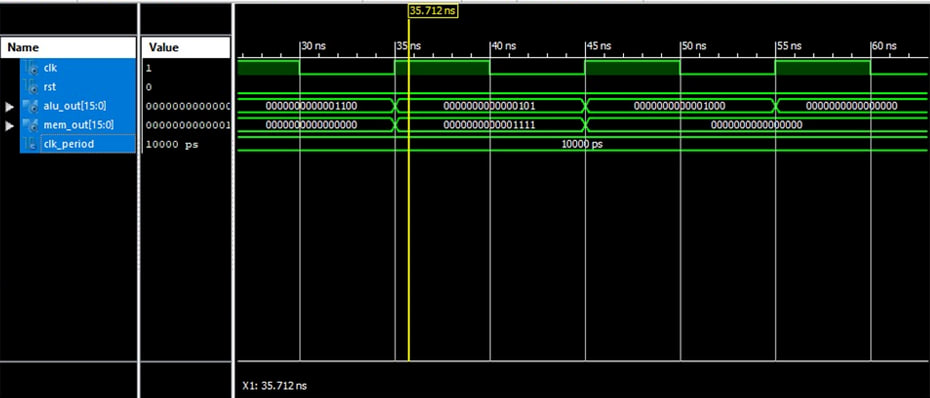

<div align="center">

# 🖥️ 16-bit RISC CPU

### Design and Simulation Using VHDL


**Computer Architecture Laboratory Project**

</div>


## 📖 Overview

This project focuses on the design and simulation of a **16-bit RISC CPU** using **VHDL** and **Xilinx ISE**.

The processor is developed using a modular architecture, integrating essential components such as the ALU, Control Unit, Register File, Program Counter, and memory units.

The project demonstrates fundamental concepts of computer architecture, digital logic design, and processor simulation.


## ✨ Key Features

| Feature | Description |
|:---|:---|
| Architecture | 16-bit RISC CPU |
| Language | VHDL |
| Design | Modular processor architecture |
| ALU | 8 arithmetic and logical operations |
| Register File | 16 general-purpose 16-bit registers |
| Memory | Separate instruction and data memory |
| Simulation | Xilinx ISim |
| Development | Xilinx ISE Design Suite |


## 🧩 CPU Architecture

The processor is organized into several interconnected modules:

- **Program Counter (PC)** — Tracks instruction addresses.
- **Instruction Memory** — Stores and provides CPU instructions.
- **Control Unit** — Decodes instructions and generates control signals.
- **Register File** — Stores and retrieves register data.
- **ALU** — Performs arithmetic and logical operations.
- **Data Memory** — Handles memory read and write operations.
- **Sign Extension** — Extends 8-bit immediate values to 16 bits.
- **Multiplexer** — Selects the appropriate ALU input.


## 🔢 ALU Operations

The ALU supports eight operations selected by a 3-bit control signal.

| ALUOp | Operation | Description |
|:---:|:---:|:---|
| 000 | ADD | Addition |
| 001 | SUB | Subtraction |
| 010 | AND | Bitwise AND |
| 011 | OR | Bitwise OR |
| 100 | XOR | Bitwise XOR |
| 101 | NOT | Bitwise NOT |
| 110 | SHL | Logical left shift |
| 111 | SHR | Logical right shift |


## 📋 Instruction Set

The Control Unit recognizes five instruction opcodes:

```text
OPCODE    INSTRUCTION    DESCRIPTION
------------------------------------------
0000      ADD            Register addition
0001      XOR            Bitwise XOR
0010      LOAD           Load data from memory
0011      STORE          Store data in memory
0100      BRANCH         Branch control signal
```


## 📁 Project Structure

```text
RISC-CPU-Design/
│
├── src/
│   ├── ALU.vhd
│   ├── ControlUnit.vhd
│   ├── DataMemory.vhd
│   ├── InstructionMemory.vhd
│   ├── RegisterFile.vhd
│   ├── cpu_top.vhd
│   ├── mux_2to1.vhd
│   ├── program_counter.vhd
│   └── sign_extend.vhd
│
├── tb/
│   └── cpu_top_tb.vhd
│
├── simulation.png
└── README.md


```

## 🧪 Simulation Results

The processor was simulated using **Xilinx ISim**.

The waveform below illustrates the CPU clock, reset, ALU output, and memory output during simulation.

<div align="center">



*CPU simulation waveform in Xilinx ISim*

</div>


